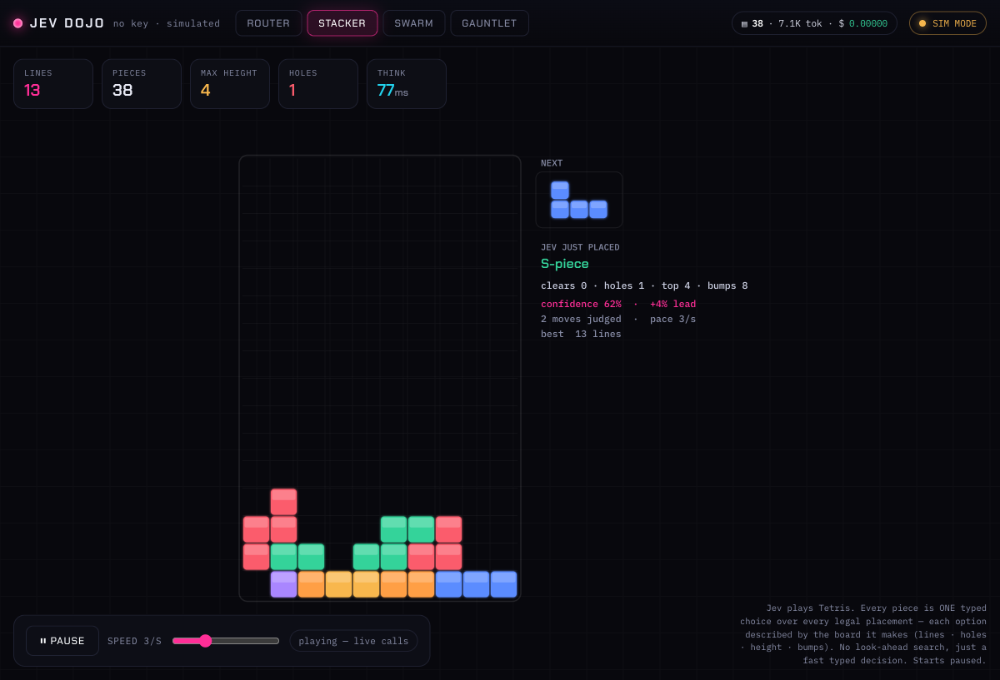

# typesafe-jev-dojo 🥋

[](https://github.com/lafollett-labs/typesafe-jev-dojo/actions/workflows/ci.yml)
[](./LICENSE)
[](.nvmrc)
[](https://www.typescriptlang.org/)

A hands-on dojo for **Jev** — TypeSafe AI's "System One" decision model: fast, **typed**
decisions (yes/no, pick-one, score-on-a-rubric), *not* an LLM. This repo exists to answer
what the hype videos never do — **how accurate is it, and how fast, on real inputs** — and
to show it off with a live, graphical, **real-time** demo (nothing pre-recorded).

> **Advisory only.** Jev returns calibrated probabilities and confidence; every scene here
> either shows the confidence or escalates low-confidence cases rather than blindly acting.



## Quick start

```bash
nvm use            # Node 26 (see .nvmrc)
npm install
npm run demo       # http://localhost:5178
```

With **no API key** the demo boots in **SIM mode** (badged amber) — decisions are generated
locally so the graphics run and you can explore offline. Add a key (below) and it flips to
**LIVE** (green badge), making real Jev calls.

## The scenes

A Node server drives four real-time canvas scenes over a single WebSocket. The server holds
the keys and makes every decision call; the browser is a pure renderer.

| Scene | What it shows |
| - | - |
| **Router** | An **endless, self-generating stream** of realistic tasks (or **type your own** and route it live, even while paused). Jev answers **3 typed questions** each — *which model tier* (choice) · *needs a human?* (noul) · *operational risk* (score) — and routes each down a neon lane. Low confidence / high risk / needs-human **escalates to REVIEW** instead of guessing. Live throughput, latency, $-saved-vs-Opus, and a decision feed. **Start / Pause / Reset.** |
| **Stacker** | **Jev plays Tetris.** Every piece is **one typed `choice`** over *every* legal placement (column × rotation), each option described by the board it produces — `clears N · +H holes · top M · bump B`. No look-ahead search — just a fast typed decision per piece. Real line clears; on top-out it stops and waits for Start. In SIM the pick uses a genetic-algorithm-tuned heuristic. **Starts paused.** |
| **Swarm** | Broadcast one event; Jev fires **N decisions in parallel**; hundreds of agents react, colored by their choice and haloed by confidence. |
| **Gauntlet** | The honest scene: a **40-task labeled set** (with deliberately ambiguous cases) → **Jev vs. Claude**, scored against ground truth. Green/red per task, accuracy / latency / cost bars, **per-category accuracy**, and a **confusion matrix** showing exactly which categories Jev mixes up — the numbers the demos skip. |

### Controls & stopping

- Every scene that makes repeated calls (**Router**, **Stacker**) **opens paused** behind a
  **Start / Pause** button and a speed slider — nothing is billed until you press Start.
  Both have a **Reset** (wipe stats / board and start fresh); Router also lets you **type any
  task and route it live** on demand.
- **Swarm** and **Gauntlet** run only on their button press.
- The **Ledger** (top-right counter) opens a live, scrollable log of every billed call —
  input, verdict, tokens, latency, cost — and is also appended to `logs/transactions.jsonl`.
- Kill the server: **Ctrl-C** in its terminal (or `pkill -f "src/server/index.ts"`).

## API tokens & configuration

Copy the template and set **one** Jev transport. The server picks a transport in this order:
**native TypeSafe → OpenRouter → SIM**.

```bash
cp .env.example .env
```

| Variable | Purpose | Notes |
| - | - | - |
| `TYPESAFE_API_KEY` | **Native TypeSafe** Jev transport (`POST api.typesafe.ai/v1/systemone`). | **Preferred.** Authoritative schema. Get it from the TypeSafe console. |
| `OPENROUTER_API_KEY` | **OpenRouter** Jev transport (`POST openrouter.ai/api/alpha/decisions`). | Used only if `TYPESAFE_API_KEY` is empty. |
| `CLAUDE_CODE_OAUTH_TOKEN` | Claude = the **Gauntlet's** LLM opponent. | Optional. Billed to your **Claude subscription**, never a metered API key — run `claude setup-token` and paste the result. Without it, Gauntlet simulates the opponent. |
| `JEV_MODEL` | Override the Jev model. | Optional. Native default `jev-latest`; OpenRouter `typesafe/jev-1.13`. |
| `CLAUDE_MODEL` | Override the Claude opponent model. | Optional. Default `claude-haiku-4-5`. |
| `PORT` | HTTP/WebSocket port. | Optional. Default `5178`. |

Billing note: Jev is priced per **input** token ($0.042 / 1M at time of writing); output is
free. The Ledger's cost column reflects that. `.env` is git-ignored — keep your keys there.

## Other entrypoints

```bash
npm run smoke      # fire ONE real decision; print raw + typed answer + latency + cost
npm run typecheck  # TypeScript 7, strict
```

## How the Stacker works

The interesting bit — **candidate generation + Jev as the judge**, which is how you'd
actually deploy a fast typed model. Jev has no search and no Tetris knowledge:

1. The engine (`src/server/stacker.ts`) enumerates **every legal placement** of the current
   piece (up to ~34) and, for each, computes the board it would produce.
2. A cheap generator **prunes and shortlists**: it drops any move that buries a hole when a
   clean move exists (the one rule that prevents death spirals), then keeps the ~10 strongest
   candidates — presented to Jev in board order, so the pool is strong but the *pick* isn't nudged.
3. Jev is handed the board itself — a top-to-bottom `#`/`.` **matrix** plus per-column heights —
   and each candidate is described by its **footprint and columns** *and* its effect:
   `cols 5-8 (4w×1h) · clears 1 · +0 holes · top 5 · bump 3`, so it can reason about *where* a
   piece lands and *how* it's rotated, not just the resulting numbers.
4. Jev returns the winning option key + per-option probabilities. The server locks that
   placement, clears full rows, and streams the new board. The readout shows Jev's confidence
   **and** its lead over the runner-up — with many near-equal moves, a 35% pick that beats the
   next-best by +20% is decisive even though the raw probability looks modest.

On top-out the game **stops** and waits — press Start for a fresh game. In **SIM mode** the
same candidate set is scored by a well-known genetic-algorithm-tuned heuristic (Yiyuan Lee's
weights: `0.76·lines − 0.51·aggHeight − 0.36·holes − 0.18·bumpiness`), which plays
near-optimally — a useful yardstick for the live model.

## Layout

```
src/jev/          Typed Jev client — answers inferred from your questions; native + OpenRouter transports
src/shared/       WebSocket protocol shared by server and client
src/server/       Demo server: live Jev + Claude-subscription opponent, SIM fallback, scene engines
src/server/stacker.ts   Pure Tetris engine (rotations, placements, line clear, heuristic scoring)
src/client/       Canvas UI (index.html + main.ts, bundled on the fly by esbuild, hot-reload)
src/smoke.ts      One-shot decision proof
docs/             Verified API contract + research dossier
```

## Tech stack

Node 26 · TypeScript 7 (strict, ESM) · `tsx` + esbuild (on-the-fly client bundle & hot
reload) · `ws` · Canvas 2D. No framework, no build step to run — `npm run demo` and go.
`node --watch` restarts the server on server-side edits; esbuild hot-reloads the client.

## Contributing

Issues and PRs welcome — see [CONTRIBUTING.md](./CONTRIBUTING.md). Keep it typed and keep the
scenes honest (show confidence, don't fake competence).

## License

[MIT](./LICENSE) © LaFollett Labs. Jev and TypeSafe are trademarks of their respective
owners; this is an independent, unaffiliated research/demo project.
